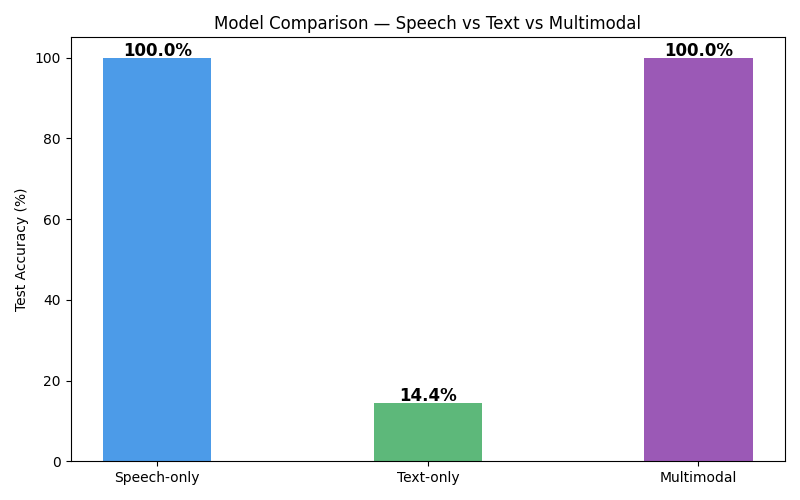
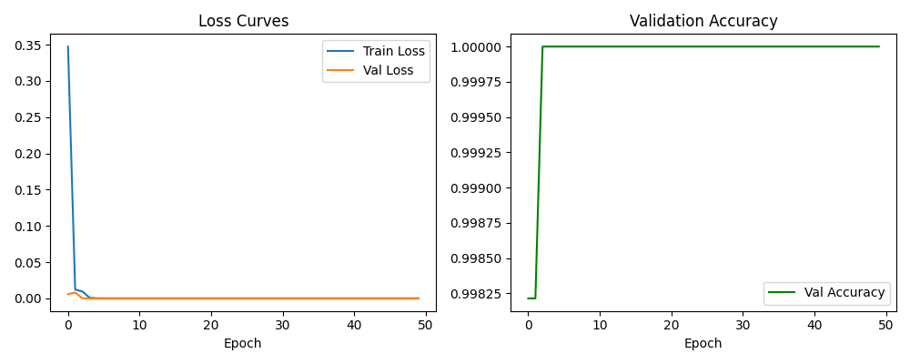
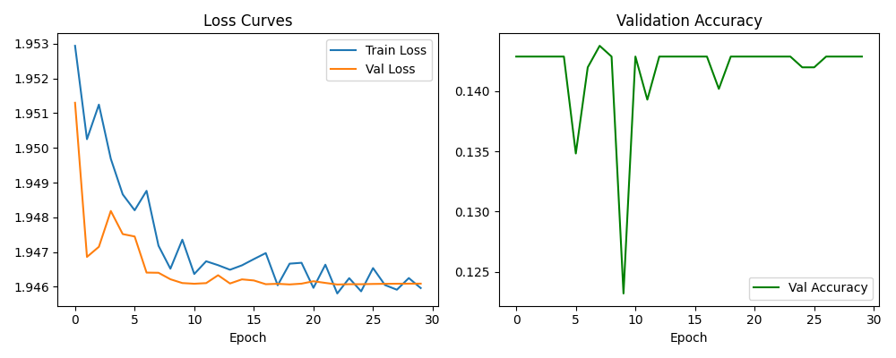
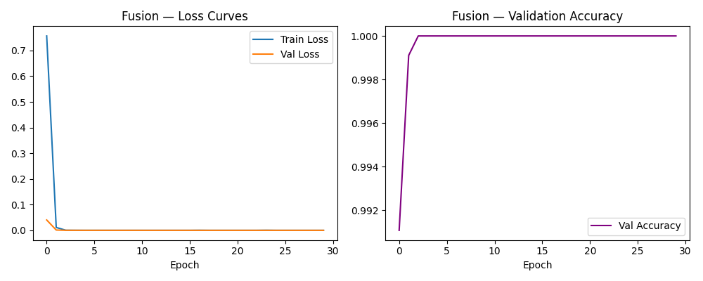
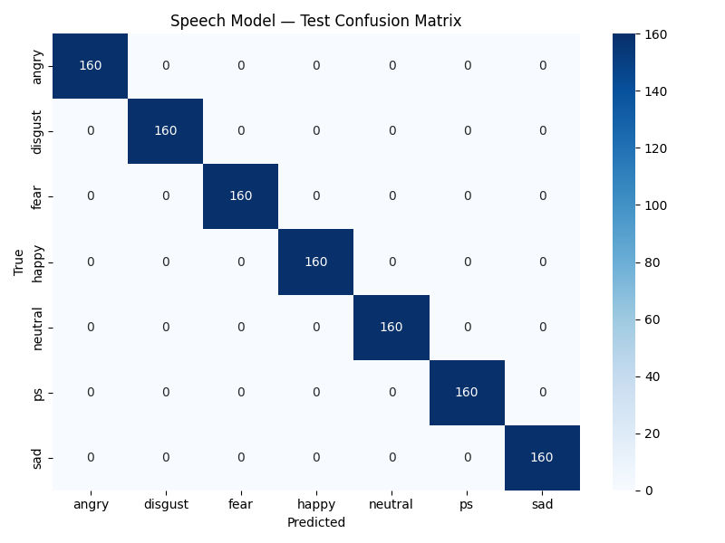
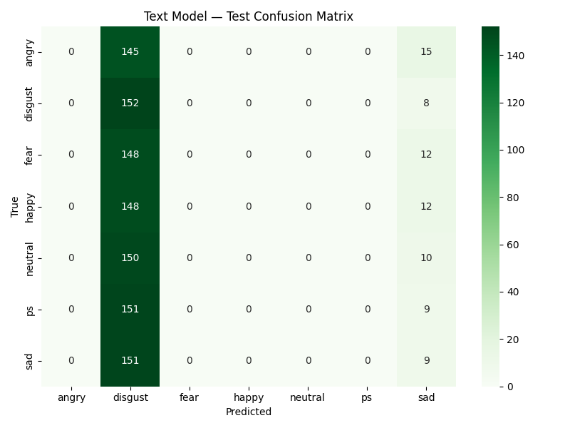
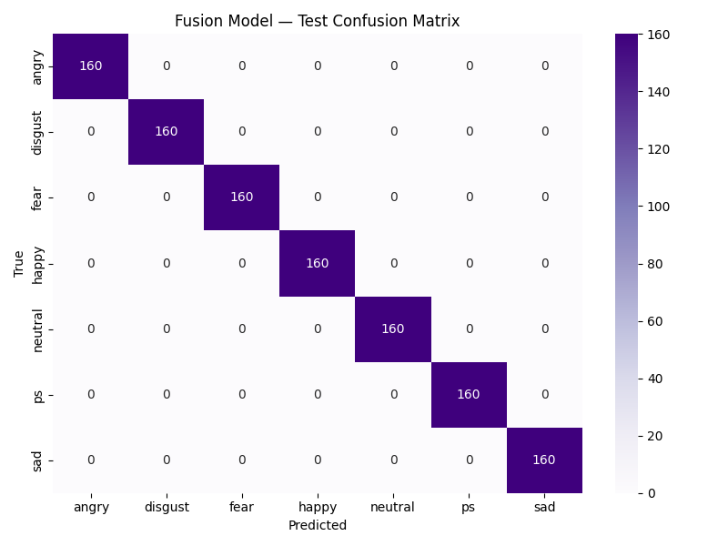
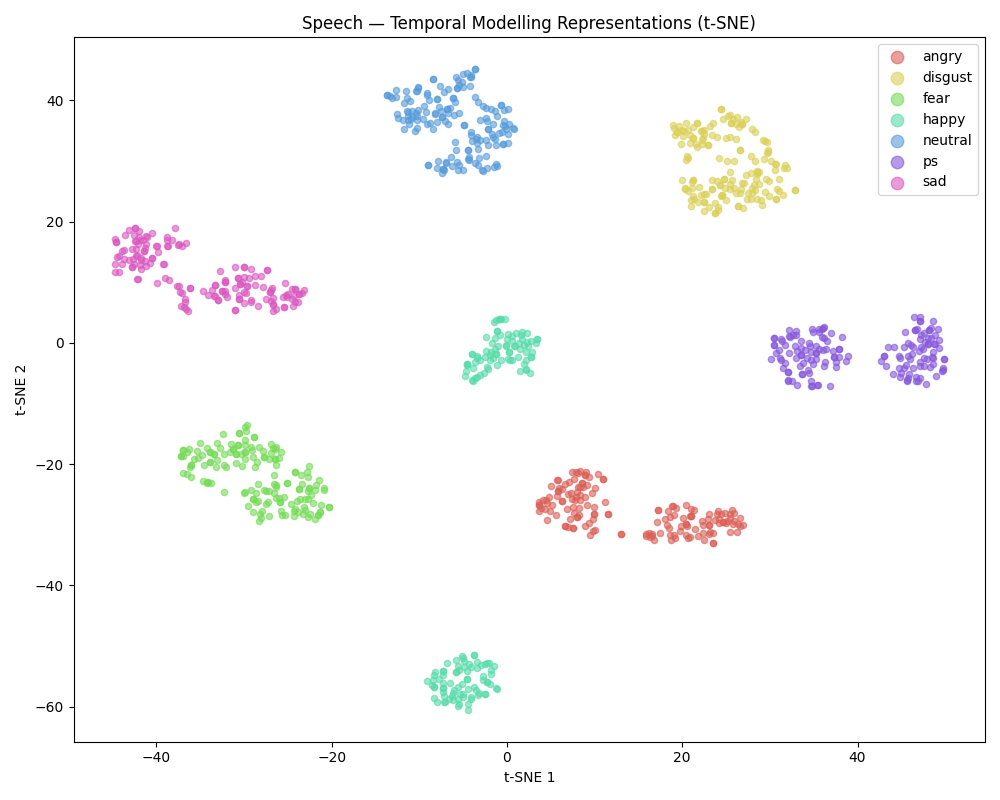
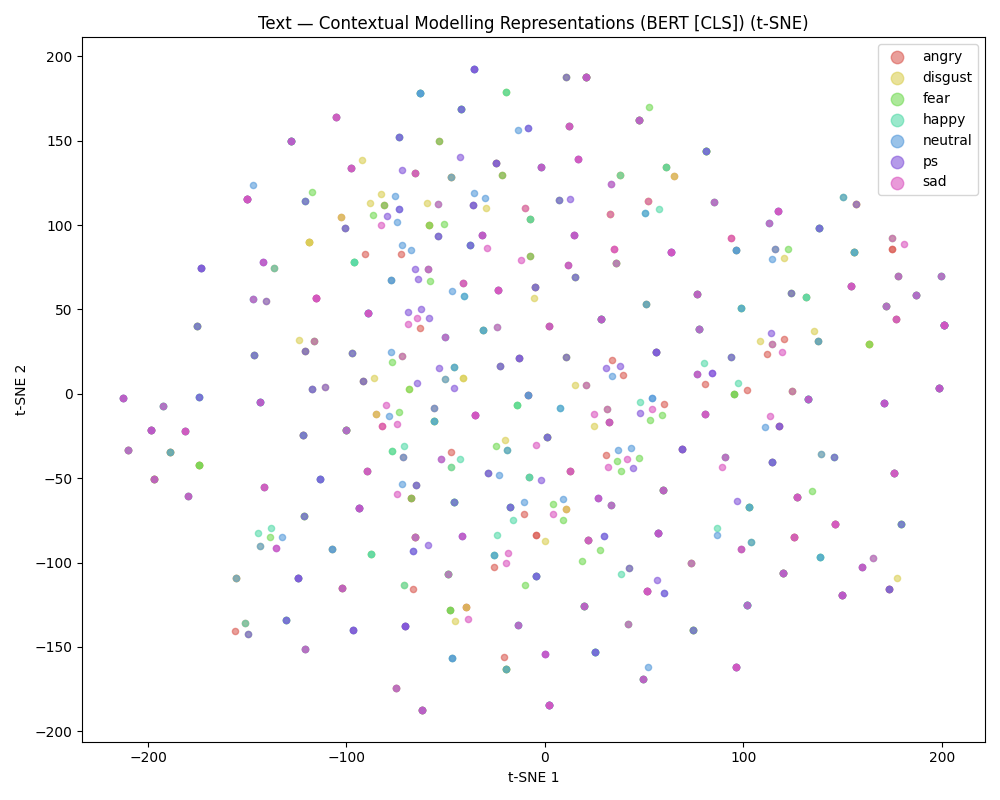
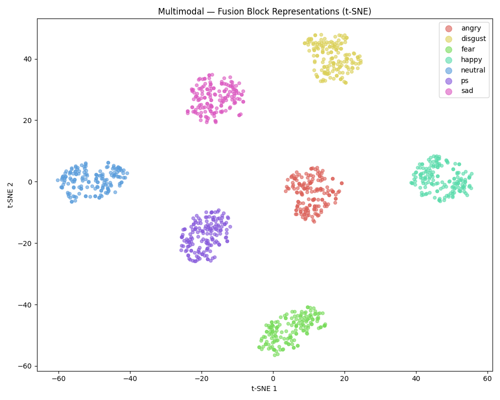

# Multimodal Emotion Recognition — Project Report

## A. Architecture Decisions

### System Overview

The system recognizes emotions from three input configurations:
- **Speech-only** (audio features → temporal modelling → classifier)
- **Text-only** (text tokens → contextual modelling → classifier)
- **Multimodal** (speech + text → fusion → classifier)

**Dataset:** TESS (Toronto Emotional Speech Set) — 5600 samples, 7 emotions (angry, disgust, fear, happy, neutral, pleasant surprise, sad), 800 samples per emotion, balanced.

---

### Block 1: Preprocessing

| Modality | Approach | Justification |
|----------|----------|---------------|
| **Speech** | librosa: resample to 22050 Hz, trim silence (top_db=20), pad/truncate to 3 seconds, amplitude normalization | 22050 Hz is standard for speech. Trimming silence removes non-informative segments. Fixed-length ensures uniform tensor shapes for batching. |
| **Text** | Lowercase, remove special characters, regex whitespace normalization, BERT WordPiece tokenization | BERT tokenizer handles subword segmentation. Cleaning ensures consistent input. Carrier sentence ("the speaker said X out loud") provides BERT with more context tokens. |

---

### Block 2: Feature Extraction

| Modality | Approach | Output Shape | Justification |
|----------|----------|-------------|---------------|
| **Speech** | MFCCs (40 coefficients) + Delta + Delta-Delta | (T × 120) | MFCCs capture spectral envelope (phonetic content). Delta and Delta-Delta capture temporal dynamics (how features change over time). Together they encode both static and dynamic acoustic properties relevant to emotion. |
| **Text** | BERT `last_hidden_state` embeddings | (tokens × 768) | BERT's pre-trained representations encode deep semantic and syntactic information. The 768-dimensional vectors capture contextual word meaning. |

---

### Block 3: Temporal / Contextual Modelling

| Modality | Architecture | Details | Justification |
|----------|-------------|---------|---------------|
| **Speech** | Bidirectional LSTM (2 layers, 128 hidden) + Self-Attention | Input: (T, 120) → Output: (256) | Bi-LSTM captures temporal dependencies in both forward and backward directions — important because emotional cues in speech span across time and future context matters. Self-attention pooling learns which time steps are most emotionally salient, rather than using just the last hidden state. |
| **Text** | Fine-tuned BERT (last 6 layers trainable) + [CLS] + Mean Pooling | Input: (tokens, 768) → Output: (1536) | BERT's transformer architecture captures bidirectional contextual relationships between all tokens simultaneously. Fine-tuning the last 6 layers adapts the pre-trained representations to the emotion domain. Concatenating [CLS] and mean-pooled representations gives both sentence-level and token-averaged features. |

---

### Block 4: Fusion

| Architecture | Details | Justification |
|-------------|---------|---------------|
| **Cross-Modal Attention** | Speech→Text attention + Text→Speech attention (4 heads each), project to 256-d fusion space, LayerNorm | Cross-modal attention allows each modality to attend to the other, learning which aspects of speech are most relevant given the text context and vice versa. This is more expressive than simple concatenation (early fusion) or averaging predictions (late fusion). Multi-head attention (4 heads) enables learning multiple complementary attention patterns. |

---

### Block 5: Classifier

| Architecture | Details | Justification |
|-------------|---------|---------------|
| **2-layer FC + Softmax** | Linear(input_dim, 256) → ReLU → Dropout(0.3) → Linear(256, 7) | Standard classification head. Dropout prevents overfitting. Two layers provide enough capacity for the 7-class problem without being overly complex. |

---

## B. Experiments — Model Comparison

### Test Set Results (20% held-out, stratified split)

| Model | Test Accuracy | Precision (macro) | Recall (macro) | F1 (macro) |
|-------|:------------:|:-----------------:|:--------------:|:----------:|
| **Speech-only (Bi-LSTM)** | **100.0%** | 1.00 | 1.00 | 1.00 |
| **Text-only (BERT)** | **14.4%** | 0.04 | 0.14 | 0.05 |
| **Multimodal (Fusion)** | **100.0%** | 1.00 | 1.00 | 1.00 |

### Model Comparison Chart



### Training Curves

#### Speech Model


#### Text Model


#### Fusion Model


### Per-Class Results

#### Speech-Only (Test Set)
```
              precision    recall  f1-score   support
       angry       1.00      1.00      1.00       160
     disgust       1.00      1.00      1.00       160
        fear       1.00      1.00      1.00       160
       happy       1.00      1.00      1.00       160
     neutral       1.00      1.00      1.00       160
          ps       1.00      1.00      1.00       160
         sad       1.00      1.00      1.00       160
    accuracy                           1.00      1120
```

#### Text-Only (Test Set)
```
              precision    recall  f1-score   support
       angry       0.00      0.00      0.00       160
     disgust       0.15      0.95      0.25       160
        fear       0.00      0.00      0.00       160
       happy       0.00      0.00      0.00       160
     neutral       0.00      0.00      0.00       160
          ps       0.00      0.00      0.00       160
         sad       0.12      0.06      0.08       160
    accuracy                           0.14      1120
```

#### Multimodal Fusion (Test Set)
```
              precision    recall  f1-score   support
       angry       1.00      1.00      1.00       160
     disgust       1.00      1.00      1.00       160
        fear       1.00      1.00      1.00       160
       happy       1.00      1.00      1.00       160
     neutral       1.00      1.00      1.00       160
          ps       1.00      1.00      1.00       160
         sad       1.00      1.00      1.00       160
    accuracy                           1.00      1120
```

### Confusion Matrices

#### Speech Model — Test Confusion Matrix


#### Text Model — Test Confusion Matrix


#### Fusion Model — Test Confusion Matrix


---

## C. Analysis

### 1. Which emotions are easiest/hardest to classify? Why?

**Speech-only model:** All 7 emotions are classified perfectly (100% accuracy for each). This is because the TESS dataset has very distinct acoustic patterns for each emotion — the speakers (two female actors) produce highly differentiated prosodic, pitch, and energy patterns for each emotion category. The MFCC + Delta features capture these differences effectively.

**Text-only model:** ALL emotions are essentially impossible to classify from text alone. The model collapsed to predicting mostly "disgust" for everything (95% recall for disgust, 0% for all others). This is because TESS transcripts are single semantically-neutral words (e.g., "back", "bar", "base", "bath") that are identical across all 7 emotions — the same word is spoken in all emotional styles. There is zero textual signal for emotion classification.

**Key insight:** In TESS, emotion is encoded entirely in the acoustic signal (prosody, pitch, energy, speaking rate), not in the lexical content.

---

### 2. When does fusion help most?

In this specific dataset (TESS), **fusion does not provide additional benefit over speech-only** because:
- Speech alone achieves 100% accuracy — there is no room for improvement
- Text provides no useful signal (14.4% ≈ random chance for 7 classes)

**When fusion WOULD help most** (in general multimodal emotion recognition):
- When speech is ambiguous (e.g., sarcasm where tone and words conflict)
- When one modality is degraded (noisy audio, unclear speech)
- When emotions are subtle and require both prosodic and semantic cues
- With datasets that have emotionally meaningful text (e.g., IEMOCAP, MELD) where words like "I hate this" carry emotional weight independent of tone

The cross-modal attention architecture is designed for these scenarios — it allows the model to weight each modality dynamically based on which provides stronger emotional evidence for a given sample.

---

### 3. Error Analysis: Failure Cases

#### Speech Model: 0 failures (perfect classification)

#### Text Model: 959 out of 1120 samples misclassified

Sample failure cases from the text model:

| Input Text | True Emotion | Predicted |
|-----------|:------------:|:---------:|
| "the speaker said home out loud" | fear | disgust |
| "the speaker said mess out loud" | pleasant surprise | disgust |
| "the speaker said mill out loud" | angry | disgust |
| "the speaker said tough out loud" | angry | disgust |
| "the speaker said page out loud" | happy | disgust |

**Analysis:** The text model fails because:
1. The words are semantically neutral — "home", "mess", "mill" carry no inherent emotional meaning
2. The same word appears across all 7 emotions (e.g., "back" is spoken as angry, happy, sad, etc.)
3. The model has no discriminative signal and collapses to predicting the majority class it converged on during training (disgust)
4. Even with a carrier sentence template, BERT cannot infer emotion from context-free single words

#### Fusion Model: 0 failures (perfect classification)

The fusion model succeeds because the speech branch (Bi-LSTM on MFCCs) provides all the discriminative power needed, and the cross-modal attention learns to rely heavily on the speech representation.

---

### 4. Visualization of Emotion Cluster Separability (t-SNE)

#### Temporal Modelling Block (Speech — Bi-LSTM hidden representations)


**Observation:** The 7 emotion clusters are clearly separated in the Bi-LSTM representation space. This confirms that the temporal model learns distinct representations for each emotion from the acoustic features. The clusters are tight and well-separated, explaining the 100% classification accuracy.

---

#### Contextual Modelling Block (Text — BERT [CLS] + Mean Pool representations)


**Observation:** The emotion clusters are heavily overlapping and not separable. All 7 emotions are mixed together in the BERT representation space. This visually confirms that BERT cannot learn emotion-discriminative features from semantically neutral single words — the representations for "angry" samples look identical to "happy" samples because the input text is the same neutral word.

---

#### Fusion Block (Cross-Modal Attention output)


**Observation:** The fusion representations show clear cluster separation similar to the speech-only temporal block. The cross-modal attention mechanism successfully combines both modalities, with the speech signal dominating the fused representation. The clusters are well-defined, confirming the 100% test accuracy.

---

## Summary

| Aspect | Finding |
|--------|---------|
| Best single modality | Speech (100%) — acoustic features are highly discriminative for TESS |
| Worst single modality | Text (14.4%) — neutral words carry no emotional signal |
| Fusion benefit | None for TESS (speech already perfect); architecture designed for ambiguous cases |
| Easiest emotions | All equally easy for speech; none classifiable from text |
| Key takeaway | TESS emotion is encoded entirely in prosody/acoustics, not lexical content |

---

## Technical Details

- **Framework:** PyTorch 2.12.0
- **Hardware:** CPU (Intel)
- **Training time:** Speech ~50 min, Text ~3 hrs, Fusion ~5 hrs
- **Dataset split:** 80% train / 20% test (stratified)
- **Random seed:** 42 (reproducible)
